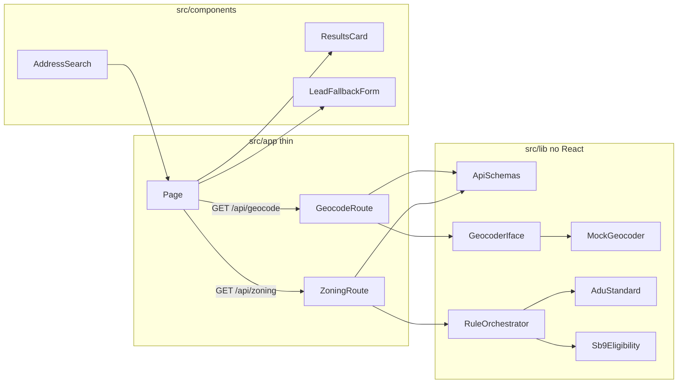

# Proposed Git File Structure

## Folder theory (canonical; copy into project reference files)

This text is the source for [README.md](README.md), [ARCHITECTURE.md](ARCHITECTURE.md), [`.cursorrules`](.cursorrules), and [`.cursor/rules/architecture.mdc`](.cursor/rules/architecture.mdc). Do not put it in `AGENTS.md` (Next.js 16 regenerates that file).

### 1. Routing-intensive (`src/app/`)

Theory: Next.js framework contract only — network, caching, SSR. Not a place for statute logic or reusable UI.

Execution: `route.ts` stays thin (traffic cop): validate → adapter/rules → JSON, plus `setTimeout` for `loading.tsx` / `Spinner`. `error.tsx` is `"use client"`.

`page.tsx` is the **client composition root** (`"use client"` is required because it uses `useState`). It must **import** `AddressSearch`, `ResultsCard`, and `LeadFallbackForm` — never paste those components’ markup or fetch logic into the page. It owns only the cross-component state and the zoning fetch that glues them together. No statute `if`/`else` in the page (that lives in `src/lib/rules`).

### 2. Component-intensive (`src/components/`)

Theory: Visual representation and client interaction. Split generic `ui/` from domain `features/`.

Execution: **No `index.ts` barrels in `ui/` or `features/`.** Use `AddressSearch/AddressSearch.tsx` (not `index.tsx`) to avoid IDE tab confusion and keep tree-shaking. Named exports. Tailwind only: `emerald-600` Eligible, `amber-500` Warning, `rose-600` Restricted. Icons only from `lucide-react`. Complex state in colocated hooks (`useAddressSearch.ts`). SOLID: hooks and presentational components stay separate.

### 3. Logic-intensive (`src/lib/`)

Theory: Heart of the app. **Zero React.** Must be portable to a Node CLI or worker.

Execution:

- **Engine (`lib/rules/`):** This is the prep-guide `src/lib/adu-rules.ts` (do **not** create a flat `src/lib/adu-rules.ts`). Split ADU (§ 65852.2) from SB 9 (§ 65852.21). Use real `if`/`else` or `switch` on parcel **facts** (zoning, tiny-home overlay, fire/VHFHSZ, historic, coastal). Do not store Eligible/Warning/Restricted on mock parcels. Inline comments must cite the statute and explain **why**. `lib/rules/index.ts` is the orchestrator (unified `ZoningReport`).
- **Mocks and adapters (`lib/mock/` + `lib/adapters/`):** Routes call a `Geocoder` adapter, never mock parcels directly. `mock-geocoder.ts` implements `Geocoder`. Phase 2 adds `regrid-geocoder.ts` (or Mapbox) to the same interface with **zero** changes to rules or UI.

### Security and git hygiene

- `.cursorignore` must include `.env*`, `.next/`, `node_modules/`, `*.pem`, `*.key` so agents do not index secrets or burn tokens on build output.
- `.env.example` defines `NEXT_PUBLIC_API_URL` and placeholder keys. Never commit `.env`.
- `src/lib/env.ts` Zod-validates required keys at **build/start** (fail fast). Mock-required: `NEXT_PUBLIC_API_URL`. Mapbox/Regrid keys optional until Phase 2.

This keeps the 80% (UI + legal engine) from blocking the 20% (swap real GIS later).

## Decision engine logic (prep-guide `adu-rules.ts`)

Monitor `src/lib/rules/*.ts` the way the Cursor prep guide says to monitor `src/lib/adu-rules.ts`. The engine must contain **actual branching** (`if`/`else` or `switch`), not a map of address → canned status.

**Inputs (facts only)** from `Parcel` / overlays: `zoning` (e.g. `R-1`, `RS`, `C-2`), `tinyHomeFriendly` (boolean overlay), `fireHazard` / `vhfhsz` (VHFHSZ or mapped fire overlay), `historicDistrict`, `coastalZone`.

**Outputs:** per-program `EligibilityResult` (`eligible` | `warning` | `restricted`) plus `reasons[]` (statute-cited). Orchestrator builds `ZoningReport`. Overall badge: `restricted` if both programs restricted; else `warning` if either is warning; else `eligible`. ResultsCard for eligible/warning; LeadFallbackForm when overall is `restricted` (and optionally on `warning`).

### ADU — `adu-standard.ts` (Gov. Code § 65852.2)

Evaluate in this order (first match that is not a continue-to-next overlay warning may still accumulate warnings; **hard stops** return immediately):

1. **Single-family / residential zoning (hard stop).** `switch`/`if` on zoning class. If the lot is **not** zoned to allow a single-family or multifamily dwelling (e.g. commercial `C-2`, industrial), return `restricted`. Why: ministerial ADU under § 65852.2 applies to lots zoned for those residential uses, not commercial-only sites.
2. **Fire hazard overlay (warning, not denial).** If `vhfhsz` or `fireHazard`, push `warning`: objective fire / Ch. 7A / defensible-space standards apply; § 65852.2 does not authorize denying the ADU solely for the overlay. Why: keep ADU path open with amber UI.
3. **Tiny Home friendly overlay (eligible + note).** If `tinyHomeFriendly`, mark ADU `eligible` and add a reason that the overlay supports compact/THOW-style ADUs still subject to § 65852.2 size and utility rules. Why: this is an affirmative local overlay, not a restriction.
4. **Historic district (warning).** If `historicDistrict`, `warning`: ADU still allowed if **objective** design standards are met (§ 65852.2); not a CUP. Contrast with SB 9 below.
5. **Coastal zone (warning).** If `coastalZone`, `warning`: Coastal Act / CDP may apply in addition to ministerial ADU.
6. **Default.** Qualifying residential zone, no blocking facts → `eligible` (standard single-family ADU path).

### SB 9 — `sb9-eligibility.ts` (Gov. Code § 65852.21)

1. **Single-family zoning (hard stop).** If not a single-family zone (`R-1` / `RS` / equivalent), `restricted`. Why: § 65852.21 two-unit / lot-split path is for single-family residential lots.
2. **Historic district (hard stop).** If `historicDistrict`, `restricted`. Why: SB 9 excludes historic districts; ADU law does not use this as a hard ban.
3. **Fire hazard / VHFHSZ (hard stop).** If `vhfhsz` or `fireHazard`, `restricted` for SB 9. Why: mock-MVP treats fire overlays as SB 9 exclusion (stricter than ADU’s warning). Comment the statute/exclusion rationale in-file.
4. **Coastal zone (warning).** If `coastalZone`, `warning` (additional coastal review).
5. **Default.** Single-family, no SB 9 exclusions → `eligible`.

Tiny Home overlay does **not** by itself grant or deny SB 9; only zoning + exclusions above apply.

### What is forbidden in the engine

- Returning a status copied from mock JSON (`status: "eligible"` on the parcel).
- A single `if (address === "123 Main")` demo branch.
- Empty functions that always return `eligible`.
- React, fetch, or Mapbox inside `src/lib/rules/`.

### Tests (`src/lib/__tests__/adu-rules.test.ts`)

Drive the engine with **facts** from `mock/properties.ts`. Assert branching, not snapshots of the whole report only:

- R-1, no overlays → ADU eligible, SB 9 eligible, overall eligible
- R-1 + `tinyHomeFriendly` → ADU eligible with tiny-home reason
- R-1 + VHFHSZ/fire → ADU warning, SB 9 restricted, overall warning
- R-1 + historic → ADU warning, SB 9 restricted
- `C-2` (or non-residential) → both restricted, overall restricted (LeadFallbackForm path)
- R-1 + coastal → warnings, not a commercial-style hard ban

## `page.tsx` wiring (imports + useState, no pasted UI)

Do not dump feature JSX into [`src/app/page.tsx`](src/app/page.tsx). Replace the create-next-app template by **importing** the feature modules and lifting shared state with `useState`.

Required imports (explicit paths, no barrels):

```ts
"use client";

import { useState } from "react";
import { AddressSearch } from "@/components/features/AddressSearch/AddressSearch";
import { ResultsCard } from "@/components/features/ResultsCard/ResultsCard";
import { LeadFallbackForm } from "@/components/features/LeadFallbackForm/LeadFallbackForm";
import { Spinner } from "@/components/ui/Spinner";
import type { GeocodeResult } from "@/lib/types/gis";
import type { ZoningReport } from "@/lib/types/zoning";
```

State the page owns (pass down as props / callbacks; do not duplicate inside ResultsCard):

- `geocodeResult: GeocodeResult | null` — set when AddressSearch resolves (mock coords / `addressId`)
- `report: ZoningReport | null` — set after `GET /api/zoning?addressId=...` (or lat/lng)
- `isZoningLoading: boolean` — true while zoning fetch is in flight (show `Spinner`)
- `error: string | null` — fetch/validation failures

Unidirectional flow:

1. `AddressSearch` uses `useAddressSearch` for combobox/geocode UI state. On success it calls `onResolved(geocodeResult)` — the page `setGeocodeResult` and kicks off zoning fetch. The page does **not** inline the search input.
2. Page `fetch(`${env NEXT_PUBLIC_API_URL}/api/zoning?...`)`, then `setReport`.
3. Render: if `isZoningLoading` → `Spinner`; else if `report.overall === "restricted"` → `LeadFallbackForm` (pass address); else if `report` → `ResultsCard report={report}`; else nothing (empty search).

Forbidden in `page.tsx`: copied AddressSearch markup, rule engine branches, hardcoded eligible/restricted JSX, `evaluateEligibility` imports (rules stay on the server in the route).

## Binding placement rules

Same four folders as `.cursorrules`, tightened by the theory above.

Forbidden: second root `app/`; reusable UI in `src/app/` or `src/lib/`; React in `src/lib/`; statute logic in components; feature/ui `index.ts` barrels; extra `*.css` besides `src/app/globals.css`.

## Review: prep guide vs this repo

- Next.js **16.3.1**, React 19, Tailwind **v4**, `app/` at repo root — must move to `src/app/`.
- [`tsconfig.json`](tsconfig.json) `@/*` → `./*` must become `./src/*`.
- Tokens in `globals.css` `@theme` (v4). Do not add a v3 `content: []` Tailwind config.
- Debug log [`.cursor/debug-fab1b0.log`](.cursor/debug-fab1b0.log) is not ignored.

## Target tree (what Git should track)

```
adu-eligibility-checker/
├── .github/
│   ├── dependabot.yml
│   └── workflows/ci.yml
├── .husky/pre-commit
├── .cursor/rules/architecture.mdc   # alwaysApply: Folder Theory for the agent
├── .cursorrules                     # same theory + stack + placement
├── .cursorignore                    # .env* .next/ node_modules/ *.pem *.key coverage/
├── .gitignore
├── .prettierignore
├── .prettierrc
├── .npmrc
├── .nvmrc
├── AGENTS.md                        # Next.js-generated only; do not duplicate theory
├── ARCHITECTURE.md                  # canonical Folder Theory (human + agent)
├── CLAUDE.md                        # @ARCHITECTURE.md and @AGENTS.md
├── README.md                        # setup runbook + short architecture + link to ARCHITECTURE.md
├── .env.example                     # NEXT_PUBLIC_API_URL=http://localhost:3000 plus placeholder keys
├── package.json / package-lock.json
├── next.config.ts                   # reactStrictMode: true
├── tsconfig.json                    # strict; @/* → ./src/*
├── eslint.config.mjs
├── postcss.config.mjs
├── vitest.config.ts
├── public/favicon.ico
└── src/
    ├── app/                         # ROUTING-INTENSIVE — thin framework contract
    │   ├── globals.css              # @theme semantic colors; Tailwind only CSS file
    │   ├── layout.tsx
    │   ├── page.tsx                 # "use client"; import features; useState glue; no pasted UI
    │   ├── loading.tsx              # exercised via route setTimeout
    │   ├── error.tsx                # "use client"
    │   ├── not-found.tsx
    │   └── api/
    │       ├── geocode/route.ts     # validate → Geocoder adapter → JSON + latency
    │       └── zoning/route.ts      # validate → rules orchestrator → JSON + latency
    ├── components/                  # COMPONENT-INTENSIVE — no barrels
    │   ├── ui/
    │   │   ├── Badge.tsx            # emerald / amber / rose status
    │   │   ├── Card.tsx
    │   │   └── Spinner.tsx          # lucide-react
    │   └── features/
    │       ├── AddressSearch/
    │       │   ├── AddressSearch.tsx
    │       │   └── useAddressSearch.ts
    │       ├── ResultsCard/
    │       │   ├── ResultsCard.tsx
    │       │   └── RuleDetail.tsx   # legal rationale from ZoningReport
    │       └── LeadFallbackForm/
    │           └── LeadFallbackForm.tsx
    └── lib/                         # LOGIC-INTENSIVE — zero React
        ├── env.ts                   # Zod; fail fast on NEXT_PUBLIC_API_URL
        ├── types/
        │   ├── gis.ts
        │   └── zoning.ts            # EligibilityResult, Overlays, SB9 flags, ZoningReport
        ├── validations/
        │   └── api-schemas.ts
        ├── adapters/
        │   ├── geocoder.ts          # Geocoder interface (Phase 2 implementors)
        │   └── mock-geocoder.ts     # implements Geocoder; reads lib/mock
        ├── rules/
        │   ├── adu-standard.ts      # § 65852.2 if/else: SF zoning, fire warn, tiny-home, historic, coastal
        │   ├── sb9-eligibility.ts   # § 65852.21 if/else: SF only; historic+fire hard stops
        │   └── index.ts             # orchestrator → ZoningReport (replaces prep-guide adu-rules.ts)
        ├── __tests__/
        │   └── adu-rules.test.ts    # asserts derived status from facts (not canned)
        └── mock/
            └── properties.ts        # facts only: zoning, tinyHomeFriendly, fire, historic, coastal
```

No `src/components/ui/index.ts` or `src/components/features/index.ts`. No `tailwind.config.ts` unless a later need appears; tokens live in `globals.css`.

### Other necessities

- Dependabot at `.github/dependabot.yml` (not under `workflows/`).
- Scripts: `dev`, `build`, `start`, `lint`, `format`, `typecheck`, `test`, `test:watch`, `prepare`.
- CI: `npm ci` → typecheck → lint → vitest on `.nvmrc`.
- `Geocoder` interface file so Phase 2 does not touch routes, rules, or UI.



Import examples (explicit paths, no component barrels):

- `import { AddressSearch } from "@/components/features/AddressSearch/AddressSearch"`
- `import { ResultsCard } from "@/components/features/ResultsCard/ResultsCard"`
- `import { LeadFallbackForm } from "@/components/features/LeadFallbackForm/LeadFallbackForm"`
- `import { Badge } from "@/components/ui/Badge"`
- `import { evaluateEligibility } from "@/lib/rules"`
- `import type { Geocoder } from "@/lib/adapters/geocoder"`
- `import { mockGeocoder } from "@/lib/adapters/mock-geocoder"`

## Project-level reference files (must contain Folder Theory)

- [ARCHITECTURE.md](ARCHITECTURE.md): Folder Theory + **full decision-engine if/else spec** + security hygiene (canonical).
- [README.md](README.md): local runbook, three-layer summary, link to `ARCHITECTURE.md` (including “how eligibility is decided”).
- [`.cursorrules`](.cursorrules): same directives plus engine if/else-on-facts, and **page.tsx imports features + useState (never paste component source)**.
- [`.cursor/rules/architecture.mdc`](.cursor/rules/architecture.mdc): `alwaysApply: true` (Folder Theory + engine spec).
- [CLAUDE.md](CLAUDE.md): `@ARCHITECTURE.md` then `@AGENTS.md`.

Keep those copies aligned. `README.md` must not be the only place this lives. Do not duplicate the theory in `AGENTS.md`.

## Git / Cursor ignore

`.gitignore`: `.env*` with `!.env.example`; `.next/`; `node_modules/`; `coverage/`; `*.pem`; `*.key`; `.cursor/*.log`.

`.cursorignore` **must** list: `.env*`, `.next/`, `node_modules/`, `*.pem`, `*.key`, plus `coverage/` and `*.log`.

`.env.example` at minimum:

```
NEXT_PUBLIC_API_URL=http://localhost:3000
# MAPBOX_ACCESS_TOKEN=
# REGRID_API_KEY=
```

## Scaffolding steps (after plan approval)

1. Move `app/` → `src/app/`; map `@/*` to `./src/*`; `reactStrictMode: true`.
2. Write Folder Theory **and the decision-engine spec** into `ARCHITECTURE.md`, `README.md`, `.cursorrules`, `.cursor/rules/architecture.mdc`, and `CLAUDE.md`.
3. Add ignore files, `.env.example`, toolchain (zod, prettier, husky, vitest, CI).
4. Create the `src/` tree: thin API routes with `setTimeout`, no component barrels, `Geocoder` + `mock-geocoder`, mock parcels as **facts only**.
5. Wire [`src/app/page.tsx`](src/app/page.tsx) as `"use client"`: import the three features, `useState` for geocode/report/loading/error, conditional ResultsCard vs LeadFallbackForm. Do not paste feature implementations into the page.
6. Implement `src/lib/rules` with the if/else order above. Tests in `src/lib/__tests__/adu-rules.test.ts` must fail if someone hard-codes status on the parcel.

## Out of scope

- Live Mapbox / Regrid / Turf / GeoJSON (new adapter file only)
- Pino, Sentry
- Downgrading Next.js 16
